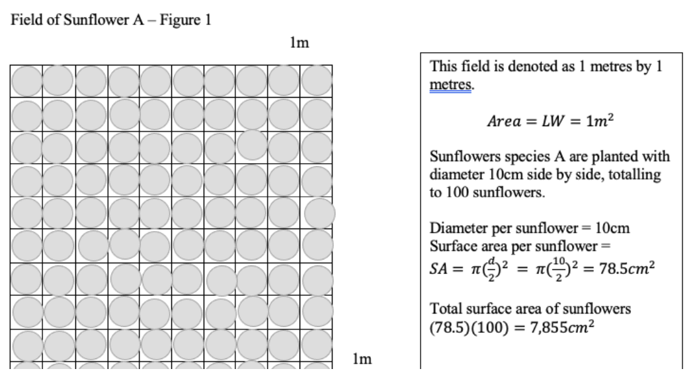
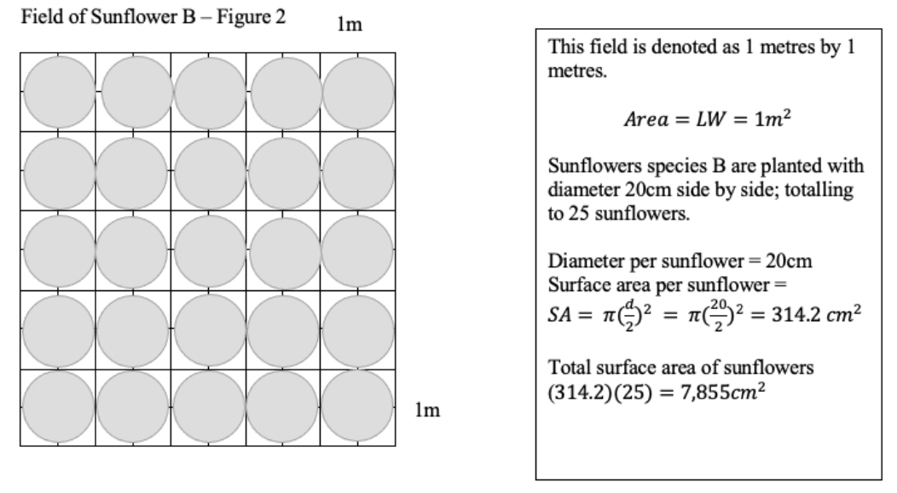
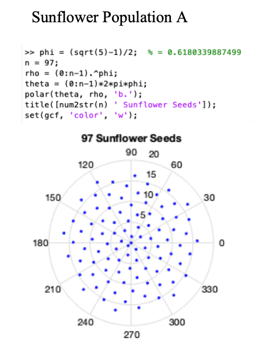
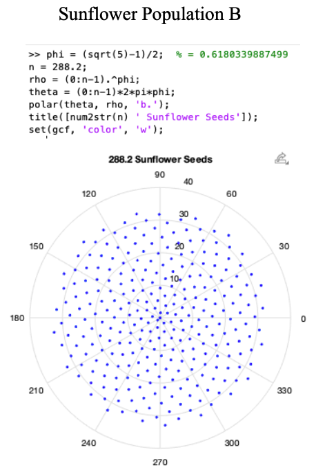
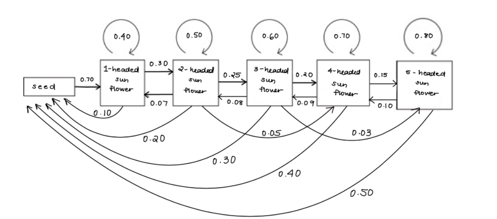

# Maximizing Seed Production with Optimal Spatial Parameters of Silverleaf Sunflowers

**Mannat Kaur**  
**MATH 3052 - Mathematical Biology**  
**Professor Heffernan**

## Project Highlights
- Built a Lefkovitch matrix model for 2 Silverleaf sunflower populations
- Compared seed production under different spatial planting parameters
- Used eigenvalue-based age-structured population modelling
- Simulated long-term viability and fecundity using Maple
---

## Table of Contents
- [Abstract](#abstract)
- [Introduction & Biology](#introduction--biology)
- [Modelling](#modelling)
- [Sensitivity Analysis](#sensitivity-analysis)
- [Results](#results)
- [Discussion](#discussion)
- [Next Steps](#next-steps)
- [Appendix](#appendix)
- [References](#references)

---

## Abstract

Silverleaf sunflowers are multi-stemmed rare perennial herbaceous flowers native to the coast of Texas which grow between 6-15ft and have silvery-green foliage. They typically produce between one to five flowering heads in their lifetime. The production of achene seeds are compressed on the disk of the flowering head which follow a spiral increments of the Golden ratio. Endangered Species Act have listed Silverleaf sunflowers as becoming extremely rare; there is a possibility of this species heading towards endangerment.

We will develop a mathematical framework that will model the biological survival and viability probability of 2 populations (Population A and B) of Silverleaf sunflowers through 2 seasons with the same spatial parameters. We will create a Lefkovitch matrix and utilizing Maple software to model the stability according to age in each population and predict the rate at which the population of Silverleaf sunflowers is declining or increasing.

After 2 seasons, Population A produced 557,857.77 seeds; Population B produced approximately 1.6 million seeds (1.65347388400000*10^6). This brings us to a conclusion for producing maximal seed density, we must have open, wide rows to offer culture and room for sunflower roots and heads to flourish to their most extraordinary capacity. In next steps, we want to monitor the population of Silverleaf sunflowers in terms of other factors such as predators, weather variability etc. for a couple of years since they are perennials. This will offer us better conclusions to the future of Silverleaf sunflower species.

---

## Introduction & Biology

Helianthus Annuus sunflowers are members of the Asteraceae plant family, which includes over 100 species of perennial and annual cultivated herbs native to North America.

Helianthus Agrophyllus, known as Silverleaf sunflower is a rare perennial herbaceous flower native to the coast of Texas. They are multi-stemmed flowers which grow between 6-15ft and have silvery-green foliage. They are usually harvested in the soil from May to June and last until the end of August. Silverleaf sunflowers typically produce between one to five flowering heads in their lifetime. The flowering heads are heliotropic meaning it rotates to face the sun. They have 10-15 yellow to orange petals per head, which makes them very appealing to predators.

Silverleaf sunflowers produce a disc of mature achene seeds surrounded by their petals and reach up to 20 cm in diameter. Achenes are dry fruit seeds known as their offspring, varying in colour, often dark with white stripes. Florets contain these achene seeds that are compressed and flat in shape on the disk of the flowering head. The arrangements of the florets are laid out to maximize the plant’s exposure to the sun to maximize the reproduction growth of achene seeds since they are iteroparous plants. Florets spiral filling each gap between themselves starting from the center of the flowering head to the edge of the disc. Each floret accounts for a given slope arrangement towards the next by the golden angle, which can be calculated as 0.618.

The lifetime of Silverleaf sunflowers is divided into 6 stages. Before germinating, achene seeds spend a year in the soil. Because they are perennial plants, they store their nutrients and seeds beneath the earth to regrow each summer. They will begin growing from the ground after germination in early spring. Perennial sunflowers are recognized for their slow growth, which allows them to bloom for 8-12 weeks. The sunflower will produce one blooming head throughout this period. The sunflower may develop one head again the next season or grow two heads. In later years, the sunflower can produce three, four, or five heads. After this, mature seeds are dispersed away from the host plant and develop into more surrounding plants and the cycle starts again.

Iteroparous sunflowers should be planted in well-drained soil at 1 to 12 inches. To improve overall growth, 1-row spacing is crucial in yield generation. According to research, tight rows of sunflowers do not yield more; open rows are preferred to offer culture and room for sunflower roots and heads to flourish to their most extraordinary capacity. Sunflower seeding rates are combined with sensitivity which means that a larger head size with more seeds per plant results in a thinner stem. Seeding refers to the number of sources required per plant to develop a sufficient stand. Seeding can establish plant patterns in a field to maximize reproductivity.

According to studies from the Endangered Species Act, some perennial sunflowers under the classification of Helianthus Annuus are becoming extremely rare; there is a possibility of this species heading towards endangerment. Perennial sunflowers are known for their slow growth, which is likely to decline due to overharvesting with minimal reproduction. The population of Silverleaf sunflowers is deteriorating. As a result, during its life cycle, a sunflower has a certain probability of dying, staying in its stage, or moving on to the next stage. For example, we expect achene seeds to develop into 1-headed sunflowers in the next season, but some may not develop into 2-headed or 3-headed sunflowers the following season and eventually, if this cycle continues, the population will naturally drift into extinction. The evolution of Silverleaf sunflowers over time may disappear one day.

This leads to our ultimate motivation for this project.

We will develop a mathematical framework that will model the biological survival and viability probability of 2 populations of Silverleaf sunflowers through 2 seasons. The two populations will have different diameters of flowering discs to help us to optimize the maximum number of seeds according to their field size for the next harvesting season. We will assume that all resources, such as water, soil, temperature, and sunshine through their life cycle (6 stages) are constant to determine the yield of sunflower seeds. To calculate maximal seed density, we will use a formula based on the golden ratio and disc diameter. Using this, we will gain the total number of achene seeds on a disc to help us set parameters for fecundity levels for each population. We will design an environment where sunflowers can develop to their full height and size without collapsing. We will create a Lefkovitch matrix using given parameters to model the stability according to age in each population. By utilizing Maple software, we will be able to predict the rate at which the population of Silverleaf sunflowers is declining or increasing.

---

## Modelling

To help us achieve our goal for this project, we will utilize 2 biological works of literature that have proven to employ plant modelling algorithms to predict population viability.

Kurt C et al. experimented with twin-row and single-row spatial planting with peanut plants to perform the yield of peanuts. They reported that the twin-row planting pattern of peanut plants provided a double amount of pod yield as the traditional single-row. Their results have shown that it is essential to accommodate plant density with plant spacing. Their reports have demonstrated that lower density plants per unit area increased pods per plant. This ultimately led to more plants per unit area and increased water and sunlight resources competition.

Souther, S. et al. researched the population growth rate of American Ginseng (Panax quinquefolius) which are endangered species according to their demographic responses to climatic factors. They have modelled the growth cycle of the Ginseng plant according to 8 stages: 9-month seed, 21-month seed, 33-month seed, 45-month seed, 1 leaf seedling, 2 leaf juveniles, small adults, large adults. They optimized the transition probabilities and reproductive values in each stage over the course of 2 years with different factors such as temperature and precipitation. Their reports have demonstrated that Ginseng plants are becoming extinct likely due to habitat loss and climate change. This ultimately led them to conclude that an increase in temperature predicts a natural drift of this rare plant.

### 2.1 Spatial Parameters

Consider two fields with two distinct types of sunflowers. 1 type of sunflower species can reach to a maximum diameter flowering head of 10 cm. Sunflowers A is the scientific name for this species as modelled in figure 1. The second species, indicated as B, will reach a diameter of more than 10cm, a maximum of 20cm modelled in Figure 2. Every season, we are assured that they would expand to their maximum diameter. Each field is the same size, measuring 1 m by 1 m. Creating this model to maximize seed density will allow us to understand how the population's decline affects the number of fecundity levels according to the area. Each grey circle represents 1 sunflower head.

**Field of Sunflower A – Figure 1**  


**Field of Sunflower B – Figure 2**  


From our results, Sunflower Population A results in 100 sunflowers amounting to 7,855 cm². Sunflower Population B results in 25 sunflowers amounting to 7,855 cm².

### 2.2 Maximum Seed Density

Now that we know our spatial parameters of the surface area of each population of sunflowers, we can calculate the total number of achene seeds per head, per population. Utilizing the formula for maximal seed density based upon golden ratio and disc diameter, we can accumulate the following results. For sunflower population A, we are given a radius of 5cm; diameter = 10cm. Sunflower Population B has 10cm as the radius; diameter = 20cm. Z1 = Zone 1, Z2 = Zone 2, Z3 = Zone 3 respectfully.

**Sunflower Population A**  


**Sunflower Population B**  


Therefore, the total maximum number of achene seeds per head for 1 sunflower in Population A is approximately 97. The total maximum number of achene seeds per head for 1 sunflower in Population B is approximately 288. We have modelled this seed density on Maple through the code provided.

### Offspring Levels

| Sunflower Population A | Sunflower Population B |
|---|---|
| 1-headed sunflower: 97 achene seeds | 1-headed sunflower: 288 achene seeds |
| 2-headed sunflower: 97(2) = 194 achene seeds | 2-headed sunflower: 288(2) = 576 achene seeds |
| 3-headed sunflower: 97(3) = 291 achene seeds | 3-headed sunflower: 288(3) = 864 achene seeds |
| 4-headed sunflower: 97(4) = 388 achene seeds | 4-headed sunflower: 288(4) = 1,152 achene seeds |
| 5-headed sunflower: 97(5) = 485 achene seeds | 5-headed sunflower: 288(5) = 1,440 achene seeds |

Utilizing this information will further help us to predict the fecundity levels in an age-structured model in the next section.

### 2.3 Life-Cycle Survival Probability

As mentioned earlier, Silverleaf sunflowers follow a certain life cycle in which a sunflower has a certain probability of dying, staying in its stage, or moving on to the next stage.

In this model, we will be using a flow chart to visualize the transition and reproductive values for the population of Silverleaf sunflowers in 1 year. Unfortunately, for this biological project, the data for transition probabilities for Silverleaf sunflower species are not yet researched. Due to this, we will assume similar parameters based on the biological literature on American Ginseng by Souther, S. et al. They produced a Lefkovitch matrix using fertility transition probability of going from a 9-month seed to a 21-month seed, 33-month seed to a 45-month seed, 1 leaf seedling to 2 leaf juveniles and onwards to small adults and large adults. Using similar values that they reported, we will make an assumed scientific hypothesis onto our 2 matrices for both populations.

- **xᵢ,ₜ**: the number of individuals of age *i* in year *t*
- **pᵢ**: the probability that an age *i* individual in year *t* survives to year *t + 1*
- **mᵢp₀**: the net fertility of the number of age *i* individuals in *t + 1*

To show how all these parameters work together, we will create a flow diagram including transition probabilities that we will assume from the previous biological literature mentioned. This diagram shows proposed/estimated transitional values for probability for a Silverleaf sunflower age model. This is not an accurate representation specifically for Silverleaf sunflowers but a scientifically hypothetical model.



The probability of an achene seed growing to a 1-headed sunflower is 70%.

1-head sunflowers have a 40% chance of staying in this class and 30% chance to become a 2-headed sunflower. They will produce offspring that will have 10% probability of becoming mature viable achene seeds that will follow the cycle again because some seeds may disperse, get eaten, disrupted by predators. This is due to the limited area (diameter of the flowering disc) and quantity of heads.

2-head sunflowers have a 50% chance of staying in this class and 30% chance to become a 2-headed sunflower. They also have a probability of falling back to a 1-headed sunflower by 7%. They will also produce offspring that will have 20% probability of becoming mature viable achene seeds. 2-headed sunflowers have 5% probability of becoming a 4-headed sunflower.

3-head sunflowers have a 60% chance of staying in this class and 20% chance to become a 4-headed sunflower. They will also produce offspring that will have 30% probability of becoming mature achene seeds. 2-headed sunflowers have 5% probability of becoming a 4-headed sunflower. They also have a probability of falling back to a 2-headed sunflower by 8%.

4-head sunflowers have a 70% chance of staying in this class and 15% chance to become a 5-headed sunflower. They will also produce offspring that will have 40% probability of becoming mature achene seeds. 4-headed sunflowers have 9% probability of falling back to become a 3-headed sunflower.

5-head sunflowers have a 80% chance of staying in this class. They will also produce offspring that will have 50% probability of becoming mature achene seeds. 5-headed sunflowers have 10% probability of falling back to become a 4-headed sunflower.

### Table #2

| \(p_0\) for each age class for offspring | Sunflower Population A | \(m_i p_0\) | Sunflower Population B | \(m_i p_0\) |
|---|---:|---:|---:|---:|
| 1-headed sunflower | 97 achene seeds | 97(0.10) = 9.7 | 288 achene seeds | 288(0.10) = 28.8 |
| 2-headed sunflower | 97(2) = 194 achene seeds | 194(0.20) = 38.8 | 288(2) = 576 achene seeds | 576(0.20) = 115.2 |
| 3-headed sunflower | 97(3) = 291 achene seeds | 291(0.30) = 87.3 | 288(3) = 864 achene seeds | 864(0.30) = 259.2 |
| 4-headed sunflower | 97(4) = 388 achene seeds | 388(0.40) = 155.2 | 288(4) = 1,152 achene seeds | 1152(0.40) = 460.8 |
| 5-headed sunflower | 97(5) = 485 achene seeds | 485(0.50) = 242.5 | 288(5) = 1,440 achene seeds | 1440(0.50) = 720 |

Now to visualize this onto 2 Lefkovitch matrices for each population. Let the first row represent the fecundity rates which are the shaded regions in Table #2.

### Sunflower Population A

\[
\begin{bmatrix}
0 & 9.7 & 38.8 & 87.3 & 155.2 & 242.5 \\
0.7 & 0.4 & 0.08 & 0 & 0 & 0 \\
0 & 0.3 & 0.5 & 0.09 & 0 & 0 \\
0 & 0 & 0.25 & 0.6 & 0.1 & 0 \\
0 & 0 & 0 & 0.2 & 0.7 & 0.10 \\
0 & 0 & 0 & 0 & 0.15 & 0.8
\end{bmatrix}
\]

### Sunflower Population B

\[
\begin{bmatrix}
0 & 28.8 & 115.2 & 259.2 & 460.8 & 720 \\
0.7 & 0.4 & 0.08 & 0 & 0 & 0 \\
0 & 0.3 & 0.5 & 0.09 & 0 & 0 \\
0 & 0 & 0.25 & 0.6 & 0.1 & 0 \\
0 & 0 & 0 & 0.2 & 0.7 & 0.10 \\
0 & 0 & 0 & 0 & 0.15 & 0.8
\end{bmatrix}
\]

---

## Sensitivity Analysis

We will be conducting an age-stability sensitive analysis model on Maple to see whether the population A and B of Silverleaf sunflowers are growing or declining in consideration of their spatial parameters. For this analysis, we will be using the same proposed transition values for survival probability as shown above. We will assume the matrices are accurate to our model.

For our analysis, we have used Professor Heffernan's sample Maple code to help us accurately model the age stability. If the age distribution is stable, we will find \( \lambda \) such that \( Lx = \lambda x \) where \( x \) is an eigenvector of \( L \). \( \lambda \) is the biggest, dominant, and real eigenvalue corresponding to the eigenvector.

If \( \lambda \) is greater than 1, all age classes in a particular population will be continually growing at that rate. If \( \lambda \) is less than 1, all age classes will be considered declining and the population that could possibly go into extinction.

Suppose that each population (A and B) has an initial population includes 50 achene seeds, 40 1-headed sunflowers, 30 2-headed sunflowers, 20 3-headed sunflowers, 10 4-headed sunflowers, 5 5-headed sunflowers. We can represent this as a vector, \(x_0\) for each population.

---

## Results

All results are given for both populations in Appendix 7.

Population A gives **87.77** as our dominant eigenvalue \( \lambda \).  
Population B gives **147.47** as our dominant eigenvalue \( \lambda \).

This concludes that both populations are growing and not declining.

The initial population for both populations are **155**.

After 2 season:
- **Population A produced 557,857.77 seeds**
- **Population B produced approximately 1.6 million seeds (1.65347388400000*10^6)**

**Population A Maple Results**  


**Population B Maple Results**  


---

## Discussion

From our modelling in "Spatial Parameters," we have produced surface area of 7,855 cm² for both populations. This means that both sunflowers with different diameters produce the same amount of surface area for their seed production.

Looking at the Maple results of population growth, it is quite outstanding because even with same surface area, Population B produced more seed production. This means to have the maximal seed density, we must have open, wide rows to offer culture and room for sunflower roots and heads to flourish to their most extraordinary capacity.

However, the results from this modelling is not very accurate in terms of modelling real, live sunflowers on a field. There are many more parameters that will affect the overall survival probability. These parameters include fraction of sunlight, water, temperature, precipitation etc. Not only did we calculate using a constant environment, but we did also not take account of predators. Predators can be in forms of pesticides, soil bugs, living animals such as bees and birds. If we were to add these values into our model, the population would decline since Silverleaf sunflowers are attractive due to their bright colours.

---

## Next Steps

Our next steps would be to closely work with a biologist who is an expert into growing and optimizing sunflowers specifically to produce a realistic model that would capture its true surrounding parameters.

We want to monitor the population of Silverleaf sunflowers for a couple of years since they are perennials (we can only harvest them at a certain time). We want to do a sensitivity analysis and collect our own data in order to investigate this population of Silverleaf sunflowers further in terms of ecology, biology and environmental change.

---

## Appendix

### [A1]
This figure displays florets (1,2,3…) spiraling in starting from the center. Each floret is laid out in position by the Golden Ratio, which is equal to \( \phi = 0.618 \). Each block represents seed & and each line of seeds starting from the center to edge represents a floret.

### [A2]
The golden angle is calculated as 0.618 in the following equation:

\[
\phi = 360(2-s) = 0.618...
\]

Therefore, sunflower florets follow increments of \( \phi = 0.618 \) degrees when growing.

### [A3]
Zonal structure of floret rows is visualized here in the diagram. Rows 1,2,3 have peripherical spiral forms that will follow each other and equate to the golden ratio (0.618). The radius of the Zone 1 is equal to the sum of the radiuses of Zone 2 and 3.

The formula to represent this relationship is:

\[
Zone\ 1 = \pi r^2 \phi^2 (2 - \phi^2)
\]

\[
Zone\ 2 = Z1(\phi)
\]

\[
Zone\ 3 = Z2(\phi)
\]

### [A4]
Pictured on the right, 4-headed Helianthus Agrophyllus, known as Silverleaf sunflowers, a rare perennial herbaceous flower native to the coast of Texas.

### [A5]
Diagram of Lefkovitch matrix taken from Professor Heffernan - Age Structured Model. Shown below is an age-structured model where \(x_{i,t}\) be the number of individuals of age \(i\) in year \(t\). \(p_i\) be the probability that an age \(i\) individual in year \(t\) survives to year \(t+1\). \(m_i p_0\) be the net fertility of the number of age \(i\) individuals in \(t+1\).

### [A6]
Maple sample code of modelling the seed density on a sunflower's disc using the golden ratio along with diameter.

```matlab
phi = (sqrt(5)-1)/2; % = 0.6180339887499

n = -----;

rho = (0:n-1).^phi;
theta = (0:n-1)*2*pi*phi;

polar(theta, rho, 'b.');
title([num2str(n) ' Sunflower Seeds']);
set(gcf, 'color', 'w');
```

### [A7]
Population A: Age Structured Modelling on Maple

### [A8]
Population B: Age Structured Modelling on Maple

---

## References

1. Helianthus annuus (sunflower). (n.d.). Retrieved April 24, 2022, from https://www.cabi.org/isc/datasheet/26714  
2. Southern exposure seed exchange, saving the past for the future. (n.d.). Southern Exposure Seed Exchange. Retrieved April 24, 2022, from https://www.southernexposure.com/products/silverleaf-sunflower/  
3. NatureServe explorer 2.0. (n.d.). Retrieved April 24, 2022, from https://explorer.natureserve.org/Taxon/ELEMENT_GLOBAL.2.147465/Helianthus_argophyllus  
4. Sutton, C. (1992, April 17). Science: Sunflower spirals obey laws of mathematics. New Scientist. https://www.newscientist.com/article/mg13418173-200-science-sunflower-spirals-obey-laws-of-mathematics/  
5. Helianthus argophyllus (Silverleaf Sunflower). (n.d.). Gardenia.Net. Retrieved April 24, 2022, from https://www.gardenia.net/plant/helianthus-argophyllus  
6. Spirals1, version6. (n.d.). Retrieved April 24, 2022, from http://homepages.math.uic.edu/~howard/spirals.html  
7. Designs, R. S. L. (n.d.). Perennial sunflowers. Retrieved April 24, 2022, from http://rslandscapedesign.blogspot.com/2010/10/helianthus.html  
8. What are the stages of sunflower life cycle? – Rampfesthudson.com. (n.d.). Retrieved April 24, 2022, from https://www.rampfesthudson.com/what-are-the-stages-of-sunflower-life-cycle/  
9. Berglund, D. R. (2007, September). Sunflower Production. North Dakota Agricultural Experiment Station and North Dakota State University Extension Service; North Dakota State University.  
10. Sunflower. (2016, December 19). Staro Nature’s Finest.  
11. Marin, I. V. (2001). Determination Method Of Floret Number And Their Density In Sunflower Head. *Helia*, 24(34), 41–48.  
12. Kurt, C., Bakal, H., Gulluoglu, L., & Arioglu, H. (N.D.). The Effect Of Twin Row Planting Pattern And Plant Population On Yield And Yield Components Of Peanut. *Turkish Journal Of Field Crops*, 22(1), 24–31.  
13. Souther, S. (n.d.). Demographic response of American ginseng (Panax quinquefolius L.) to climate change.  
14. MODEL A SUNFLOWER WITH THE GOLDEN RATIO. (n.d.). Retrieved April 27, 2022, from https://www.mathworks.com/matlabcentral/mlc-downloads/downloads/submissions/10796/versions/4/previews/html/sunflower.htm
